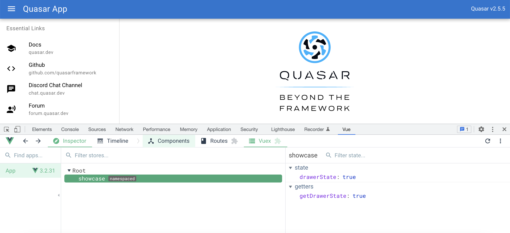

# State management Store/Vuex

## Úvod

Uvažujme príklad triviálnej aplikácie - počítadlo - ktorá pozostáva z troch kľúčových častí:
* **State** (model) - komponenty môžu mať lokálne (interné) dáta, o ktorých potrebujú vedieť iba oni. Zvykne sa používať aj pojem `source-of-truth`.  
* **View** (template) - reprezentácia komponentu, pričom **state** alebo jeho časť určuje/dotvára formu a/alebo formát (reprezentáciu) komponentu.
* **Actions** - metódy, ktoré môžu meniť **state** na základe interakcie používateľa s **view**.

```js
const Counter = {
  // state
  data () {
    return {
      count: 0
    }
  },

  // view
  template: `
    <div>{{ count }}</div>
  `,
 
  // actions
  methods: {
    increment () {
      this.count++
    }
  }
}

createApp(Counter).mount('#app')
```

Často pri vývoji väčších aplikácií máme však potrebu "zdieľat" dáta medzi komponentami. Aby sme sa vyhli neprirodzenému previazaniu komponentov použijeme **state management pattern**. 

Myšlienka je jednoduchá, zdieľané dáta medzi komponentami budú uložené v tzv. **store** (niečo ako centralizované/globálne úložisko), ktorý reprezentuje spoločný **state**, resp. **single source-of-truth** (pozn., komponent môže mať aj naďalej svoj lokálny state). Pre hlbšie pochopenie, store je len JavaScript objekt uložený v lokálnom úložisku prehliadača (angl. local storage) a obsahuje aktuálne dáta/stav aplikácie (sedenie). 

Komponenty, ktoré používajú zdieľaný **state** (store) v podstate o sebe navzájom nevedia (nie sú priamo prepojené). Budú sa navzájom ovplyvňovať tým, že menia zdieľaný **state**, ale priamo sa "nepoznajú". 

Vue rámec poskytuje natívnu podporu na vytvorenie **store**. Vieme, že Vue vlastnosť ``data`` je lokálny state/model komponentu, ktorý je ale v skutočnosti reaktívny JavaScript objekt, interne vytvorený použitím Vue funkcie ``reactive()``. Táto funkcia je súčasťou Vue public API a môžeme ju použiť na vytvorenie ľubovolného reaktívneho (dátového) objektu.  My ju použijeme na vytvorenie nášho **store**.

```js
// store.js
import { reactive } from 'vue'

export const store = reactive({
  count: 0
})
```

Ako vidíme, náš **store** obsahuje jeden atribút ``count``, ktorý budú zdieľať dva komponenty:

```js
<!-- ComponentA.vue -->
<script>
import { store } from './store.js'

export default {
  data() {
    return {
      store
    }
  }
}
</script>

<template>
  <button @click="store.count++">
    From A: {{ store.count }}
  </button>
</template>
```

a

```js
<!-- ComponentB.vue -->
<script>
import { store } from './store.js'

export default {
  data() {
    return {
      store
    }
  }
}
</script>

<template>
  <button @click="store.count++">
    From B: {{ store.count }}
  </button>
</template>
```

Zdieľaný **state** (store) sme začlenili do komponentov tak, že sme deklarovali v lokálnych state-och komponentov atribút ``store``. Cez tento atribút budeme pristupovať k a meniť zdieľané reaktívne dáta (``store.count``).  Ak meníme **state** storu (meníme hodnoty jeho atribútov), hovoríme tiež, že **mutujeme store/state**. 

V tomto okamihu, kedykoľvek store mutuje, komponenty ``ComponentA`` a ``ComponentB`` aktualizuju automaticky svoje **views**. 

Tým, že prakticky ľubovoľný komponent môže zmeniť/mutovať globálny **state**, potrebujeme zabezpečiť udržateľnosť zdrojového kódu. Vidíme, že naše komponenty mutujú store napriamo (``store.count++``). Potrebujeme, aby aplikačná logika, ktorá mutuje stav v **store** bola centralizovaná rovnako ako **state** samotný. Komponenty, ktoré budú chcieť meniť **state** v **store** budú používať metódu ("API" storu), ktorú dodefinujeme.

Upravme teda store tak, že dodefinujeme metódu ``increment()``, ktorej názov bude reflektovať zámer akcie (mutácie). 

```js
// store.js
import { reactive } from 'vue'

export const store = reactive({
  count: 0,
  increment() {
    this.count++
  }
})
```
Šablóny komponentov upravíme tak, aby používali danú metódu - mutáciu ``increment()``:

```html
<template>
  <button @click="store.increment()">
    From B: {{ store.count }}
  </button>
</template>
```

## Knižnica Vuex, použitie v Quasare

Ako sme si ukázali v predošlej časti, v menších projektoch si dokážeme vytvoriť **store** priamočiaro. Vo väčších projektoch si to pýta komplexnejší aparát. Pri vytváraní **Quasar projektu** sa nás sprievodca opýta, či chceme použiť v projekte **Vuex**. [Vuex](https://vuex.vuejs.org/) je knižnica, ktorá prináša podporu state managementu (storu) do našej [Quasar aplikácie](https://quasar.dev/quasar-cli-vite/state-management-with-vuex).

V priečinku ``src/store`` Quasar aplikácie nájdeme priečinok ``module-example``, v ktorom je viacero súborov. 

Z názvu priečinku je zrejmé, že cieľom je modularizovať store. Čim väčšiu aplikáciu vytvárame, tým rozvážnejšie by sme mali pristupovať aj k samotnému návrhu storu. Môže byť kontraproduktívne (aj z pohľadu udržateľnosti kódu) vytvoriť jeden centralizovaný store. Vytvárané komponenty združujeme do priečinkov tak, aby stromová štruktúra priečinkov reflektovala určitú logiku aplikácie. Z rovnakého dôvodu je dobré dekomponovať jeden centralizovaný store na viacero storov, ktoré budú odzrkadľovať moduly našej aplikácie. 

**Nový store module vytvoríme CLI príkazom:**
```js
quasar new store <store_name>
```

Vytvorme store modul ``quasar new store showcase``. V súbore ``store/index.js`` zaregistrujme náš vytvorený store module ``showcase``:

```js
  ...
  import showcase from './showcase'
  ...
    modules: {
      showcase
    },
  ...
```

Poďme sa oboznámiť so súbormi, ktoré sa vytvorili v priečinku ``showcase``.

Súbor ``showcase/index.js`` spája funkcionalitu store modulu:

```js
import state from "./state";
import * as getters from "./getters";
import * as mutations from "./mutations";
import * as actions from "./actions";

export default {
  namespaced: true,
  getters,
  mutations,
  actions,
  state,
};
```

V súbore ``showcase/state.js`` definujeme samostný state store modulu, a teda reaktívne dáta - atribúty - ktoré chceme zdieľať. Upravme súbor takto:

```js
export default function () {
  return {
    drawerState: true
  }
}
```

Pridali sme atribút ``drawerState`` (typu Boolean) a inicializovali ho na hodnotu ``true``. 

V súboroch ``showcase/actions.js`` a ``showcase/mutations.js`` definujeme metódy, ktoré menia/mutujú **state** storu (menia atribúty storu). Tu je potrebné si vysvetlit rozdieľ medzi **mutáciou (angl. mutation)** a **akciou (angl. action)**.

 **Mutácie** sú metódy definované v store a predstavujú jediný spôsob, cez ktorý meníme **state** storu (atribúty storu). **Do mutácie nedávame biznis logiku, mení iba state storu.** 
 
Upravme súbor ``showcase/mutations.js`` takto:

```js
export const updateDrawerState = (state, opened) => {
  state.drawerState = opened
}
```

Zadefinovali sme mutáciu ``updateDrawerState``, ktorá mení ``state`` store modulu, konkrétne atribút ``drawerState``, pričom parametrom je ``opened``.

Otvorme súbor ``src/layouts/MainLayout.vue`` a zmeňme ho takto:

```js
...
import { defineComponent } from 'vue'

export default defineComponent({
  name: 'MainLayout',

  components: {
    EssentialLink
  },

  data () {
    return {
      essentialLinks: linksList
    }
  },
  computed: {
    drawerState: {
      get () {
        return this.$store.state.showcase.drawerState
      },
      set (val) {
        this.$store.commit('showcase/updateDrawerState', val)
      }
    }
  }
})
```
Upravme udalosť ``@click`` tlačidla ``q-btn`` v hlavičke layoutu:
```js
...
@click="drawerState = !drawerState"
...
```

a ``v-model`` komponentu ``q-drawer``:
```js
 <q-drawer v-model="drawerState" show-if-above bordered>
 ...
```

Zadefinovali sme lokálny atribút ``drawerState`` typu ``computed``. Ten má akcie ``get`` a ``set``. Cez ``get`` akciu pristupujeme napriamo k store modulu ``showcase``, resp. k zdieľanému atribútu ``drawerState``.  V ``set`` akcii meníme/mutujeme stav atribútu ``drawerState`` store modulu ``showcase`` a to tak, že odovzdávame (commitujeme) zmenu do storu``$store.commit('showcase/updateDrawerState', val)`` konkrétne prostrednítctvom mutácie ``showcase/updateDrawerState``. 

Keď to zhrnieme, zmenu **state** (zmenu atribútu v store) realizujeme výlučne cez mutáciu. Ak chceme vykonať zmenu **state**, použijeme mutáciu a to tak, že odovzdáme (commitneme) danú mutáciu do storu. 

Dostávame sa k rozdieľu medzi mutáciou a akciou. Pripomeňme si:

**Mutácie** sú metódy definované v store a predstavujú jediný spôsob, cez ktorý meníme **state** storu (atribúty storu). **Do mutácie nedávame biznis logiku, mení iba state storu.** 

**Akcie** sú v princípe metódy, ktoré implementujú biznis logiku, ktorá zároveň mutuje **state** v **store**, pričom táto biznis logika je zdieľaná/centralizovaná, a je teda súčasťou storu. Akcie môžu odovzdať (commitnúť) viac ako jednu mutáciu v čase. Cez akcie **nemeníme state storu priamo**, ale **commitujeme mutácie**. 

**Pozor, mutácie sú synchrónne, akcie môžu obsahovať ľubovoľné asynchrónne operácie.**

Zadefinujme akciu v súbore ``showcase/actions.js``:
```js
export function updateDrawerStateAction (context, data) {
  context.commit('updateDrawerState', data)
  console.log(data);
}
```
Vidíme, že v akcii ``updateDrawerStateAction`` commitujeme mutáciu  ``updateDrawerState``. Context je **state** store modulu ``showcase``.  
Navyše našu triviálnu biznis logiku tvorí aj výpis do konzoly (vo webovom prehliadači v Dev Tools/console) s hodnotou parametru ``data``.

Akciu zavoláme cez store funkciu ``dispatch`` takto:
```js
  ...
  this.$store.dispatch('showcase/updateDrawerStateAction', val)
  ...
```

## Domáca úloha
Nainštalujte si do webové prehliadača rozšírenie [Vue.js devtools](https://chrome.google.com/webstore/detail/vuejs-devtools/nhdogjmejiglipccpnnnanhbledajbpd).
Oboznámte sa s novým rozšírením a funkciami, ktoré poskytuje. Rozšírenie nám zjednodušuje vývoj (debugovanie) Vue.js aplikácií. Po prejdení tohto tutoriálu si v rozšírení pozrite store module (showcase) a ako sa mení jeho state. Zároveň si všimnite, že rozšírenie prináša pohľad na aplikáciu na úrovni komponentov (nie DOMu ako takého) a ku každému komponentu máme k dispozícii podrobné informácie.


