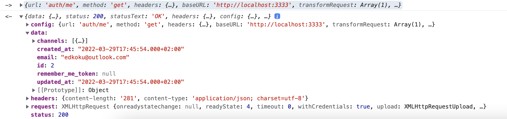
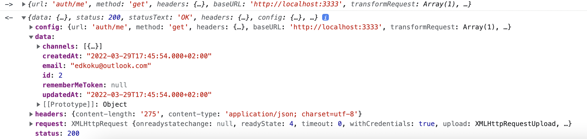

# Slek Lite - 3. časť: vytvorenie aparátu na posielanie správ cez websockety

**Obsah**:
* [Kontrakt Message](#anchor1-message)   
* [Vytvorenie komponentov na výmenu správ](#anchor2-components)   
    * [ChatLayout](#anchor21-layout)  
    * [ChannelPage](#anchor22-channelpage)  
    * [ChannelMessagesComponent](#anchor23-channelcomponent) 
* [Vytvorenie služieb na výmenu správ na klientovi (slek-client)](#anchor3-servicesc)
    * [Služba SocketManager](#anchor31-socketmanager) 
    * [Služby ChannelService a ChannelSocketManager](#anchor32-channelservice)
    * [Boot súbor pre SocketManager](#anchor33-boot)
* [Store modul channels](#anchor4-store)
    * [Store modul channels: state](#anchor41-state) 
    * [Store modul channels: mutácie](#anchor42-mutations) 
    * [Store modul channels: akcie](#anchor43-actions) 
    * [Store modul channels: gettre](#anchor44-getters) 
    * [Store modul channels: index](#anchor45-index) 
    * [Zaregistrovanie store modulu channels](#anchor46-indexs)    
* [Doplnenie akcií v store module auth](#anchor5-auths)    
* [Vytvorenie služieb na výmenu správ na serveri (slek-server)](#anchor6-server)
    * [Kontajner MessageRepository](#anchor61-repository) 
    * [Kontrakty pre kontajner MessageRepository](#anchor62-contracts) 
* [Zaregistrovanie obsluhy pre kanály na strane servera](#anchor7-route)
* [Test aplikácie - vymienanie správ](#anchor8-test)
* [Snake Case vs Camel Case konvencia](#anchor9-conv)
* [ActivityService a ActivityController](#anchor10-activity)

## <a name="anchor1-message"></a> Kontrakt Message
Podobne ako sme v predošlej časti zadefinovali kontrakty pre autentifikačný aparát (``ApiToken``, ``RegisterData``, ``LoginCredentials``, ``User``), vytvorme v priečinku ``src/contracts`` kontrakt pre správy, a teda súbor ``Message.ts`` s týmto kódom:
```ts
import { User } from './Auth'

export type RawMessage = string

export interface SerializedMessage {
  createdBy: number
  content: string
  channelId: number,
  createdAt: string,
  updatedAt: string,
  id: number,
  author: User
}
```

Do súboru ``src/contracts/index.ts`` pridajme novo-vytvorený konktrakt:
```ts
export * from './Auth'
export * from './Message'
```

## <a name="anchor2-components"></a> Vytvorenie komponentov na výmenu správ

### <a name="anchor21-layout"></a> ChatLayout

Vytvorme v priečinku ``src/layouts`` nový súbor s názvom ``ChatLayout.vue``:

```html
<template>
  <div class="WAL position-relative bg-grey-4" :style="{ height: $q.screen.height + 'px' }">
    <q-layout view="lHh Lpr lFf" class="WAL__layout shadow-3" container>
      <q-header elevated>
        <q-toolbar class="bg-grey-3 text-black">
          <q-btn
            round
            flat
            icon="keyboard_arrow_left"
            class="WAL__drawer-open q-mr-sm"
            @click="leftDrawerOpen = !leftDrawerOpen"
          />

          <q-btn round flat>
            <q-avatar color="primary" text-color="white">G</q-avatar>
          </q-btn>

          <span class="q-subtitle-1 q-pl-md">
            {{ activeChannel }}
          </span>
        </q-toolbar>
      </q-header>

      <q-drawer
        v-model="leftDrawerOpen"
        show-if-above
        bordered
        :breakpoint="690"
      >
        <q-toolbar class="bg-grey-3">
          <q-avatar class="cursor-pointer">
            
          </q-avatar>

          <q-space />

          <q-btn round flat icon="more_vert">
            <q-menu auto-close :offset="[110, 8]">
              <q-list style="min-width: 150px">
                <q-item clickable @click="logout">
                  <q-item-section>Logout</q-item-section>
                </q-item>
              </q-list>
            </q-menu>
          </q-btn>

          <q-btn
            round
            flat
            icon="close"
            class="WAL__drawer-close"
            @click="leftDrawerOpen = !leftDrawerOpen"
          />
        </q-toolbar>

        <q-scroll-area style="height: calc(100% - 100px)">
          <q-list>
            <q-item
              v-for="(channel, index) in channels"
              :key="index"
              clickable
              v-ripple
              @click="setActiveChannel(channel)"
            >
              <q-item-section>
                <q-item-label lines="1">
                  {{ channel }}
                </q-item-label>
                <q-item-label class="conversation__summary" caption>
                  {{ lastMessageOf(channel)?.content || '' }}
                </q-item-label>
              </q-item-section>

              <q-item-section side>
                <!--q-item-label caption>
                  {{ channel }}
                </q-item-label-->
                <q-icon name="keyboard_arrow_down" />
              </q-item-section>
            </q-item>
          </q-list>
        </q-scroll-area>
      </q-drawer>

      <q-page-container class="bg-grey-2">
        <router-view />
      </q-page-container>

      <q-footer>
        <q-toolbar class="bg-grey-3 text-black row">
          <q-input v-model="message" :disable="loading" @keydown.enter.prevent="send" rounded outlined dense class="WAL__field col-grow q-mr-sm" bg-color="white" placeholder="Type a message" />
          <q-btn :disable="loading" @click="send" round flat icon="send" />
        </q-toolbar>
      </q-footer>
    </q-layout>
  </div>
</template>
```
```ts
<script lang="ts">
import { defineComponent } from 'vue'
import { mapActions, mapGetters, mapMutations } from 'vuex'

export default defineComponent({
  name: 'ChatLayout',
  data () {
    return {
      leftDrawerOpen: false,
      message: '',
      loading: false
    }
  },
  computed: {
    ...mapGetters('channels', {
      channels: 'joinedChannels',
      lastMessageOf: 'lastMessageOf'
    }),
    activeChannel () {
      return this.$store.state.channels.active
    }
  },
  methods: {
    async send () {
      this.loading = true
      await this.addMessage({ channel: this.activeChannel, message: this.message })
      this.message = ''
      this.loading = false
    },
    ...mapMutations('channels', {
      setActiveChannel: 'SET_ACTIVE'
    }),
    ...mapActions('auth', ['logout']),
    ...mapActions('channels', ['addMessage'])
  }
})
</script>
```
```sass
<style lang="sass">
.WAL
  width: 100%
  height: 100%
  padding-top: 20px
  padding-bottom: 20px
  &:before
    content: ''
    height: 127px
    position: fixed
    top: 0
    width: 100%
    background-color: #009688
  &__layout
    margin: 0 auto
    z-index: 4000
    height: 100%
    width: 90%
    max-width: 950px
    border-radius: 5px
  &__field.q-field--outlined .q-field__control:before
    border: none
  .q-drawer--standard
    .WAL__drawer-close
      display: none
@media (max-width: 850px)
  .WAL
    padding: 0
    &__layout
      width: 100%
      border-radius: 0
@media (min-width: 691px)
  .WAL
    &__drawer-open
      display: none
.conversation__summary
  margin-top: 4px
.conversation__more
  margin-top: 0!important
  font-size: 1.4rem
</style>
```

V ``src/router/routes.ts`` upravme, aby cesta ``/channels`` používala ``ChatLayout`` (namiesto ``MainLayout``):
```ts
{
    path: '/channels',
    // channels requires auth
    meta: { requiresAuth: true },
    component: () => import('layouts/ChatLayout.vue'),
    children: [
      { path: '', name: 'home', component: () => import('src/pages/ChannelPage.vue') }
    ]
  },
```

### <a name="anchor22-channelpage"></a> ChannelPage

Upravme pôvodný komponent ``ChannelPage`` v priečinku ``src/pages`` takto:

```vue
<template>
  <q-page class="row items-center justify-evenly">
    <channel-messages-component :messages="messages" />
  </q-page>
</template>

<script lang="ts">
import ChannelMessagesComponent from 'src/components/ChannelMessagesComponent.vue'
import { SerializedMessage } from 'src/contracts'
import { defineComponent } from 'vue'

export default defineComponent({
  components: { ChannelMessagesComponent },
  name: 'ChannelPage',
  computed: {
    messages (): SerializedMessage[] {
      return this.$store.getters['channels/currentMessages']
    }
  }
})
</script>
```

### <a name="anchor23-channelcomponent"></a> ChannelMessagesComponent

Vytvorme v priečinku ``src/components`` komponent ``ChannelMessagesComponent.vue``:
```vue
<template>
  <q-scroll-area ref="area" style="width: 100%; height: calc(100vh - 150px)">
    <div style="width: 100%; max-width: 400px; margin: 0 auto;">
      <q-chat-message v-for="message in messages"
        :key="message.id"
        :name="message.author.email"
        :text="[message.content]"
        :stamp="message.createdAt"
        :sent="isMine(message)"
      />
    </div>
  </q-scroll-area>
</template>

<script lang="ts">
import { QScrollArea } from 'quasar'
import { SerializedMessage } from 'src/contracts'
import { defineComponent, PropType } from 'vue'

export default defineComponent({
  name: 'ChannelMessagesComponent',
  props: {
    messages: {
      type: Array as PropType<SerializedMessage[]>,
      default: () => []
    }
  },
  watch: {
    messages: {
      handler () {
        this.$nextTick(() => this.scrollMessages())
      },
      deep: true
    }
  },
  computed: {
    currentUser () {
      return this.$store.state.auth.user?.id
    }
  },
  methods: {
    scrollMessages () {
      const area = this.$refs.area as QScrollArea
      area && area.setScrollPercentage('vertical', 1.1)
    },
    isMine (message: SerializedMessage): boolean {
      return message.author.id === this.currentUser
    }
  }
})
</script>
```

Poznámka: pôvodné komponenty v priečinku ``src/components`` môžeme odstrániť, nepoužívame ich.

## <a name="anchor3-servicesc"></a> Vytvorenie služieb na výmenu správ na klientovi (slek-client)

Na výmenu správ budeme používať websockety. Používame knižnicu [socket.io](https://socket.io/). Keď si pozrieme dokumentáciu, vidíme, že potrebujeme podporu websocketov ako na klientovi, tak aj na serveri.

V serverovej časti našej aplikácie (AdonisJS:slek-server) sme si v prvej časti podporu vytvorili. Na klientovi si ju musíme vytvoriť.  

Doinštalujme balíček na podporu socketov na strane klienta:

```console
npm install socket.io-client
```

### <a name="anchor31-socketmanager"></a> Služba SocketManager

Vytvorme v priečinku ``src/services`` súbor ``SocketManager.ts``.
Úlohou služby ``SocketManager`` je manažment nad websocketmi na strane klienta. Je to akýsi wrapper nad socket.io-client. Podobne, ako službu ``AuthManager``, aj túto **službu môžeme považovať za "knižnicu as is"** a nie je potrebné jej venovať priestor. **Ak nepotrebujete, nerobte v nej zmeny**. Mala by dobre poslúžiť tak ako je:

```ts
import type { BootCallback } from '@quasar/app-webpack'
import type { StateInterface } from 'src/store'
import { Manager, Socket } from 'socket.io-client'
import { authManager } from '.'

// eslint-disable-next-line @typescript-eslint/no-explicit-any
export type BootParams<T extends BootCallback<StateInterface> = BootCallback<StateInterface>> = T extends (params: infer P) => any ? P : never

export interface SocketManagerContract {
  namespace: string
  readonly socket: Socket
  subscribe (params: BootParams): void
  destroy (): void
}

export interface SocketManagerConstructorContract {
  new (namespace: string): SocketManagerContract
  getManager (): Manager
  createManager (uri: string): Manager
  addInstance (instance: SocketManagerContract): void
  destroyInstance (instance: SocketManagerContract): void
}

const DEBUG = process.env.NODE_ENV === 'development'

export abstract class SocketManager implements SocketManagerContract {
  private static manager: Manager
  private static instances: SocketManagerContract[] = []
  private static namespaces: Set<string> = new Set()
  private static params: BootParams | null = null

  public static getManager () {
    if (!this.manager) {
      throw new Error('Socket.io Manager not created. Please call "SocketManager.createManager(uri)" in quasar boot file.')
    }

    return this.manager
  }

  public static createManager (uri?: string): Manager {
    const manager = new Manager(uri, { autoConnect: false })
    this.manager = manager
    return manager
  }

  public static addInstance (instance: SocketManagerContract): void {
    if (this.namespaces.has(instance.namespace)) {
      throw new Error(`Duplicate socket manager created for namespace "${instance.namespace}".`)
    }

    this.namespaces.add(instance.namespace)

    // if SocketManager has been already booted we can boot created instance
    if (this.params !== null) {
      this.bootInstance(instance)
    } else {
      this.instances.push(instance)
    }
  }

  public static destroyInstance (instance: SocketManagerContract & { $socket: Socket | null }): void {
    this.instances = this.instances.filter((socket) => socket !== instance)
    this.namespaces.delete(instance.namespace)
    // disconnect and clean socket
    instance.socket.disconnect()
    instance.socket.removeAllListeners()
    instance.$socket = null
  }

  private static bootInstance (instance: SocketManagerContract): void {
    // eslint-disable-next-line @typescript-eslint/no-non-null-assertion
    instance.subscribe(this.params!)
    // connect socket - if it was not used in subscribe it will be created
    instance.socket.connect()
  }

  public static boot (params: BootParams): void {
    if (this.params) {
      throw new Error('SocketManager is already booted. Call it once from quasar boot file.')
    }

    this.params = params
    // call subscribe for already created instances and connect to socket
    this.instances.forEach((instance) => this.bootInstance(instance))
    // clean instances
    this.instances = []
  }

  private $socket: Socket | null = null

  // lazily create socket
  public get socket (): Socket {
    if (!this.$socket) {
      this.$socket = this.socketWithAuth()
    }

    return this.$socket
  }

  constructor (public namespace: string) {
    (this.constructor as SocketManagerConstructorContract).addInstance(this)
  }

  // this function returns socket.io socket for given namespace which handles auth token
  private socketWithAuth (): Socket {
    const io = (this.constructor as SocketManagerConstructorContract).getManager()

    const socket = io.socket(this.namespace, {
      auth: { token: authManager.getToken() }
    })

    // eslint-disable-next-line @typescript-eslint/no-explicit-any
    socket.on('connect_error', (err: Error & { data?: any }) => {
      if (DEBUG) {
        console.error(`${this.namespace} [connect_error]`, err.message, err.data)
      }

      if (err.data?.status === 401) {
        const unsubscribe = authManager.onChange((token) => {
          socket.auth = { token }
          unsubscribe()
          socket.connect()
        })
      }
    })

    if (DEBUG) {
      socket.on('connect', () => {
        console.info(`${this.namespace} [connect]`)
      })

      socket.on('disconnect', (reason) => {
        console.info(`${this.namespace} [disconnect]`, reason)
      })

      socket.on('error', (err: Error) => {
        console.error(`${this.namespace} [error]`, err.message)
      })

      socket.onAny((event, ...args) => {
        console.info(`${this.namespace} [${event}]`, args)
      })
    }

    return socket
  }

  /**
   * This can be used to emit server event and return promise resolved with server response
   * It is is intended to be used by child class methods
   */
  // eslint-disable-next-line @typescript-eslint/no-explicit-any
  protected emitAsync<T> (event: string, ...args: any[]): Promise<T> {
    return new Promise((resolve, reject) => {
      this.socket.emit(event, ...args, (error: Error | null, response: T) => {
        error ? reject(error) : resolve(response)
      })
    })
  }

  public destroy (): void {
    (this.constructor as SocketManagerConstructorContract).destroyInstance(this)
  }

  /*
   * This method should be overidden in child class to subscribe to this.socket events
   */
  public abstract subscribe(params: BootParams): void
}
```

### <a name="anchor32-channelservice"></a> Služby ChannelService a ChannelSocketManager

Služba ``ChannelService`` nám bude vytvárať a udržiavať websocket pripojenia na jednotlivé kanály (metóda ``join``), resp. odpojenie z kanálu (metóda ``leave``). V metóde ``join`` vytvoríme inštanciu ``ChannelSocketManager``. Tento manažér sa pripája na ``socket.io`` namespace pre daný kanál, inicializuje poslucháča na udalosť **message** (na strane klienta) a poskytuje metódy ``addMessage`` a ``loadMessages``:

```ts
import { RawMessage, SerializedMessage } from 'src/contracts'
import { BootParams, SocketManager } from './SocketManager'

// creating instance of this class automatically connects to given socket.io namespace
// subscribe is called with boot params, so you can use it to dispatch actions for socket events
// you have access to socket.io socket using this.socket
class ChannelSocketManager extends SocketManager {
  public subscribe ({ store }: BootParams): void {
    const channel = this.namespace.split('/').pop() as string

    this.socket.on('message', (message: SerializedMessage) => {
      store.commit('channels/NEW_MESSAGE', { channel, message })
    })
  }

  public addMessage (message: RawMessage): Promise<SerializedMessage> {
    return this.emitAsync('addMessage', message)
  }

  public loadMessages (): Promise<SerializedMessage[]> {
    return this.emitAsync('loadMessages')
  }
}

class ChannelService {
  private channels: Map<string, ChannelSocketManager> = new Map()

  public join (name: string): ChannelSocketManager {
    if (this.channels.has(name)) {
      throw new Error(`User is already joined in channel "${name}"`)
    }

    // connect to given channel namespace
    const channel = new ChannelSocketManager(`/channels/${name}`)
    this.channels.set(name, channel)
    return channel
  }

  public leave (name: string): boolean {
    const channel = this.channels.get(name)

    if (!channel) {
      return false
    }

    // disconnect namespace and remove references to socket
    channel.destroy()
    return this.channels.delete(name)
  }

  public in (name: string): ChannelSocketManager | undefined {
    return this.channels.get(name)
  }
}

export default new ChannelService()
```

``ChannelService``združuje inštancie ``ChannelSocketManager`` (štruktúra ``Map``), pričom každá inštancia ``ChannelSocketManager`` predstavuje websocketové spojenie pre kanál jednotlivo. Všimnime si, že v metóde ``join`` služby ``ChanneService`` pri vytváraní inštancie ``ChannelSocketManager`` odovzdávame argument ``/channels/${name}``. Tým určujeme, že daný manažér slúži pre kanál s názvom ``name``. Inými slovami, každý kanál má svoj ``ChannelSocketManager``:
```ts
const channel = new ChannelSocketManager(`/channels/${name}`)
```

Keď ``ChannelSocketManager`` obdrží cez socket zo serveru udalosť **message** , poslucháč odovzdá správu pre daný kanál storu. Ide o **store module** ``channel``, ktorý vytvoríme neskôr v tejto časti tutoriálu.  

Metóda ``addMessage`` v službe ``ChannelSocketManager`` emituje cez socket na server udalosť **addMessage** pre kanál daného manažéra. Úlohou servera bude túto udalosť obslužiť, a teda odoslať správu (parameter ``message``) všetkým pripojeným klientom. Neskôr v tejto časti tutoriálu vytvoríme obsluhu na strane servera ``MessageController`` (AdonisJS: slek-server).

Podobne, metóda ``loadMessages`` emituje cez socket na server udalosť **loadMessages**. Úlohou servera bude túto udalosť obslužiť. Obsluhu tiež zadefinujeme v  ``MessageController``.

Do súboru ``src/services/index.ts`` **pridajme** ``ChannelService``:
```ts
export { default as authManager } from './AuthManager'
export { default as authService } from './AuthService'
export { default as channelService } from './ChannelService'
```

### <a name="anchor33-boot"></a> Boot súbor pre SocketManager
Pri inicializácii Quasar aplikácie (slek-client) potrebujeme vytvoriť inštanciu ``SocketManager``-a.
Vytvorme v priečinku ``src/boot`` súbor ``socket.io.ts`` s týmto kódom:
```ts
import { boot } from 'quasar/wrappers'
import { Manager } from 'socket.io-client'
import { SocketManager } from 'src/services/SocketManager'

declare module '@vue/runtime-core' {
  interface ComponentCustomProperties {
    $io: Manager
  }
}

// create socket.io manager
const io = SocketManager.createManager(process.env.API_URL)

export default boot((params) => {
  params.app.config.globalProperties.$io = io
  // boot socket manager here to allow to subscribe sockets to events and use store
  SocketManager.boot(params)
})

export { io }
```

Boot súbor **zaregistrujme** v konfiguračnom súbore Quasaru. Do ``quasar.config.js`` pridajme **socket.io**:
```ts
 boot: [
      'axios',
      'auth',
      'socket.io'
    ],
```

## <a name="anchor4-store"></a> Store modul channels
V store module ``channels`` budeme mať uložené správy pre kanály. Kľúčom bude názov kanála, hodnotou bude pole správ pre daný kanál.

Vytvorme cez Quasar CLI nový store module ``channels``:

```console
quasar new store -f ts module-channels
```

### <a name="anchor41-state"></a> Store modul channels: state

V priečinku ``src/store/module-channels`` zadefinujme ``state`` nového store modulu:
```ts
import { SerializedMessage } from 'src/contracts'

export interface ChannelsStateInterface {
  loading: boolean,
  error: Error | null,
  messages: { [channel: string]: SerializedMessage[] }
  active: string | null
}

function state (): ChannelsStateInterface {
  return {
    loading: false,
    error: null,
    messages: {},
    active: null
  }
}

export default state
```

Zadefinujme nad storom **mutácie, akcie a gettre** a **upravme indexy**.

### <a name="anchor42-mutations"></a> Store modul channels: mutácie

Kód v súbore ``module-channels/mutations.ts``:
```ts
import { SerializedMessage } from 'src/contracts'
import { MutationTree } from 'vuex'
import { ChannelsStateInterface } from './state'

const mutation: MutationTree<ChannelsStateInterface> = {
  LOADING_START (state) {
    state.loading = true
    state.error = null
  },
  LOADING_SUCCESS (state, { channel, messages }: { channel: string, messages: SerializedMessage[] }) {
    state.loading = false
    state.messages[channel] = messages
  },
  LOADING_ERROR (state, error) {
    state.loading = false
    state.error = error
  },
  CLEAR_CHANNEL (state, channel) {
    state.active = null
    delete state.messages[channel]
  },
  SET_ACTIVE (state, channel: string) {
    state.active = channel
  },
  NEW_MESSAGE (state, { channel, message }: { channel: string, message: SerializedMessage }) {
    state.messages[channel].push(message)
  }
}

export default mutation
```

### <a name="anchor43-actions"></a> Store modul channels: akcie

Kód v súbore ``module-channels/actions.ts``:
```ts
import { ActionTree } from 'vuex'
import { StateInterface } from '../index'
import { ChannelsStateInterface } from './state'
import { channelService } from 'src/services'
import { RawMessage } from 'src/contracts'

const actions: ActionTree<ChannelsStateInterface, StateInterface> = {
  async join ({ commit }, channel: string) {
    try {
      commit('LOADING_START')
      const messages = await channelService.join(channel).loadMessages()
      commit('LOADING_SUCCESS', { channel, messages })
    } catch (err) {
      commit('LOADING_ERROR', err)
      throw err
    }
  },
  async leave ({ getters, commit }, channel: string | null) {
    const leaving: string[] = channel !== null ? [channel] : getters.joinedChannels

    leaving.forEach((c) => {
      channelService.leave(c)
      commit('CLEAR_CHANNEL', c)
    })
  },
  async addMessage ({ commit }, { channel, message }: { channel: string, message: RawMessage }) {
    const newMessage = await channelService.in(channel)?.addMessage(message)
    commit('NEW_MESSAGE', { channel, message: newMessage })
  }
}

export default actions
```

### <a name="anchor44-getters"></a> Store modul channels: gettre

Kód v súbore ``module-channels/getters.ts``:
```ts
import { GetterTree } from 'vuex'
import { StateInterface } from '../index'
import { ChannelsStateInterface } from './state'

const getters: GetterTree<ChannelsStateInterface, StateInterface> = {
  joinedChannels (context) {
    return Object.keys(context.messages)
  },
  currentMessages (context) {
    return context.active !== null ? context.messages[context.active] : []
  },
  lastMessageOf (context) {
    return (channel: string) => {
      const messages = context.messages[channel]
      return messages.length > 0 ? messages[messages.length - 1] : null
    }
  }
}

export default getters
```

### <a name="anchor45-index"></a> Store modul channels: index

Kód v súbore ``module-channels/index.ts``:
```ts
import { Module } from 'vuex'
import { StateInterface } from '../index'
import state, { ChannelsStateInterface } from './state'
import actions from './actions'
import getters from './getters'
import mutations from './mutations'

const authModule: Module<ChannelsStateInterface, StateInterface> = {
  namespaced: true,
  actions,
  getters,
  mutations,
  state
}

export default authModule
```

### <a name="anchor46-indexs"></a> Zaregistrovanie store modulu channels 

V súbore ``store/index.ts`` **zaregistrujme** store module ``channels``:
```ts
import channels from './module-channels'
import type { ChannelsStateInterface } from './module-channels/state'
...
export interface StateInterface {
  auth: AuthStateInterface
  channels: ChannelsStateInterface
}
...
const Store = createStore<StateInterface>({
    modules: {
      auth,
      channels
    },
```

## <a name="anchor5-auths"></a> Doplnenie akcií v store module auth

Pripomeňme si, že v boot súbore ``boot/auth.ts`` voláme akciu ``auth/check`` store modulu ``auth`` pri každej požiadavke na zmenu smerovanie na klientovi (route). Ide o kontrolu, či je používateľ prihlásený:
```ts
const isAuthenticated = await store.dispatch('auth/check')
```

Ak predmetná routa vyžaduje prihlásenie ``to.meta.requiresAuth``, potom je používateľ nasmerovaný na prihlasovaciu obrazovku ``return loginRoute(to)``.

Keď sa používateľ úspešne prihlási, chceme mu vždy aktivovať kanál "general".

Poznámka: v našej demo aplikácii "Slek" uvažujeme na klientovi iba s jedným kanálom, a to "general" (na jednoduchšie pochopenie a ilustráciu).

 Pridajme do akcie ``check`` store modulu ``auth`` volanie akcie ``await dispatch('channels/join', 'general', { root: true })``:
```ts
..
  async check ({ state, commit, dispatch }) {
    try {
      commit('AUTH_START')
      const user = await authService.me()
      // join user to general channel - hardcoded for now
      if (user?.id !== state.user?.id) {
        await dispatch('channels/join', 'general', { root: true })
      }

      commit('AUTH_SUCCESS', user)
      return user !== null
    } catch (err) {
      commit('AUTH_ERROR', err)
      throw err
    }
  },
...
```

Akcia ``join`` v store module ``channels`` volá rovnomennú metódu ``join`` v službe ``channelService``:
```ts
channelService.join(channel).loadMessages()
```
Metóda ``join`` v ``channelService`` vytvára novú inštanciu ``ChannelSocketManager``. Úlohou manažéra je zaregistrovať poslucháča na udalosť **message** (prichádzajúce správy) pre daný kanál ("general"):
```ts
this.socket.on('message', (message: SerializedMessage) => {
    store.commit('channels/NEW_MESSAGE', { channel, message })
})
```
Poslucháč odovzdá každú prichádzajúcu správu **message** pre daný kanál ("general") do storu ``channels``: 
```ts
commit('channels/NEW_MESSAGE', { channel, message })
```

Zároveň ``ChannelSocketManager`` poskytuje metódu ``addMessage`` na odoslanie/emitovanie novo-vytvorenej správy používateľom na server (pre kanál "general") a metódu ``loadMessages`` na načítanie správ pre daný kanál ("general").

Ďalej v store module ``auth`` upravme akciu ``logout``, a to pridaním volania akcie ``channels/leave`` (store modulu ``channels``):

```ts
..
async logout ({ commit, dispatch }) {
    try {
      commit('AUTH_START')
      await authService.logout()
      await dispatch('channels/leave', null, { root: true })
      commit('AUTH_SUCCESS', null)
      // remove api token and notify listeners
      authManager.removeToken()
    } catch (err) {
      commit('AUTH_ERROR', err)
      throw err
    }
  }
```

## <a name="anchor6-server"></a> Vytvorenie služieb na výmenu správ na serveri (slek-server)

Vytvorme v priečinku ``app/Controllers`` priečinok ``Ws`` a v ňom controller ``MessageController.ts`` s týmto kódom:

```ts
import type { WsContextContract } from '@ioc:Ruby184/Socket.IO/WsContext'
import type { MessageRepositoryContract } from '@ioc:Repositories/MessageRepository'
import { inject } from '@adonisjs/core/build/standalone'

// inject repository from container to controller constructor
// we do so because we can extract database specific storage to another class
// and also to prevent big controller methods doing everything
// controler method just gets data (validates it) and calls repository
// also we can then test standalone repository without controller
// implementation is bind into container inside providers/AppProvider.ts
@inject(['Repositories/MessageRepository'])
export default class MessageController {
  constructor (private messageRepository: MessageRepositoryContract) {}

  public async loadMessages({ params }: WsContextContract) {
    return this.messageRepository.getAll(params.name)
  }

  public async addMessage({ params, socket, auth }: WsContextContract, content: string) {
    const message = await this.messageRepository.create(params.name, auth.user!.id, content)
    // broadcast message to other users in channel
    socket.broadcast.emit('message', message)
    // return message to sender
    return message
  }
}
```

``MessageController`` má dve metódy. Metóda ``loadMessages`` získa všetky správy pre daný kanál (``params.name``) z databázy (v našom prípade z SQLite). 

Metóda ``addMessage`` uloží správu do databázy a prešíri (broadcast) ju všetkým pripojeným klientom. 

### <a name="anchor61-repository"></a> Kontajner MessageRepository

Vidíme, že obidve metódy v controlleri ``MessageController`` používajú ``MessageRepository``. Našim cieľom je udržiavať biznis logiku controllerov čo najpriamočiarejšiu (aby neobsahovali dlhý špagetový kód). 

Preto vytvoríme IoC kontajner ``MessageRepository`` ([viac o IoC kontajneroch v dokumentácii](https://legacy.adonisjs.com/docs/4.1/ioc-container)), v ktorom bude oddelená logika na zrealizovanie dopytov do DB a vytvorenie inštancie správy. 

Vytvorme v priečinku ``app`` priečinok ``Repositories`` a v ňom súbor ``MessageRepository.ts`` s týmto kódom:

```ts
import type { MessageRepositoryContract, SerializedMessage } from '@ioc:Repositories/MessageRepository'
import Channel from 'App/Models/Channel'

export default class MessageRepository implements MessageRepositoryContract {
  public async getAll(channelName: string): Promise<SerializedMessage[]> {
    const channel = await Channel.query()
      .where('name', channelName)
      .preload('messages', (messagesQuery) => messagesQuery.preload('author'))
      .firstOrFail()

    return channel.messages.map((message) => message.serialize() as SerializedMessage)
  }

  public async create(channelName: string, userId: number, content: string): Promise<SerializedMessage> {
    const channel = await Channel.findByOrFail('name', channelName)
    const message = await channel.related('messages').create({ createdBy: userId, content })
    await message.load('author')

    return message.serialize() as SerializedMessage
  }
}
```

Vidíme, že ``MessageRepository`` deklaruje metódy ``getAll`` a ``create``. ``MessageController`` pristupuje k týmto metódam cez ``MessageRepositoryContract``. Zároveň ``MessageRepository`` používa kontrakt ``SerializedMessage``. 

### <a name="anchor62-contracts"></a> Kontrakty pre kontajner MessageRepository

Vytvorme v priečinku ``./contracts`` súbor ``repositories.ts``:

```ts
// here we are declaring our MessageRepository types for Repositories/MessageRepository
// container binding. See providers/AppProvider.ts for how we are binding the implementation 
declare module '@ioc:Repositories/MessageRepository' {
  export interface SerializedMessage {
    createdBy: number
    content: string
    channelId: number,
    createdAt: string,
    updatedAt: string,
    id: number,
    author: {
      id: number,
      email: string,
      createdAt: string,
      updatedAt: string
    }
  }

  export interface MessageRepositoryContract {
    getAll(channelName: string): Promise<SerializedMessage[]>
    create(channelName: string, userId: number, content: string): Promise<SerializedMessage>
  }

  const MessageRepository: MessageRepositoryContract
  export default MessageRepository
}
```

V súbore ``./providers/AppProvider.ts`` v metóde ``register`` zaregistrujme vytvorenie inštancie``MessageRepository`` kontajnera:
```ts
public register() {
  // bind our implementation of MessageRepository to container
  this.app.container.singleton('Repositories/MessageRepository', (container) => {
  // just make instance of app/Repositories/MessageRepository class
     return container.make('App/Repositories/MessageRepository')
  })
}
```

## <a name="anchor7-route"></a> Zaregistrovanie obsluhy pre kanály na strane servera

Pri HTTP protokole definujeme smerovanie (routes) v súbore ``start/routes.ts``. V prípade websocketov definujeme obsluhu v súbore ``start/socket.ts``:
```ts
import Ws from '@ioc:Ruby184/Socket.IO/Ws'

// this is dynamic namespace, in controller methods we can use params.name
Ws.namespace('channels/:name')
  // .middleware('channel') // check if user can join given channel
  .on('loadMessages', 'MessageController.loadMessages')
  .on('addMessage', 'MessageController.addMessage')
```

Vidíme, že udalosť ``loadMessages`` obslúži metóda ``loadMessages`` v ``MessageController``. Podobne udalosť ``addMessage``. Pripomeňme si, že na klientovi (slek-client) ``ChannelSocketManager`` emituje udalosti ``loadMessages`` a ``addMessage``.

## <a name="anchor8-test"></a> Test aplikácie - vymienanie správ

V tomto kroku by nám mala aplikácia fungovať. 

Spustime slek-client:
```console
quasar dev
```

Spustime slek-server:
```console
node ace serve --watch
```

1. Vo webovom prehliadači si otvorme v inkognito okne Quasar klienta (slek-client).
2. Zaregistrujme dvoch používateľov. 
3. Prihlásme sa s jedným používateľom. 
4. Otvorme ďalšie inkognito okno s Quasar klientom.
5. Prihlásme sa s druhým používateľom. 
6. Vyberme vľavo kanál "general".

Hotovo, malo by fungovať vymienanie správ medzi používateľmi.

## <a name="anchor9-conv"></a> Snake Case vs Camel Case konvencia

Všimnime si v konzole, že dáta nám chodia v "Snake Case" konvencii, napr. ``created_at``, ``updated_at``:



Keď sa ale pozrieme na kontrakt ``User`` v ``src/contracts/Auth.ts`` používame "Camel Case" konvenciu (napr. ``createdAt``). Potrebujeme na serveri zabezpečiť (AdonisJS:slek-server), aby sa serializácia modelov realizovala v "Camel Case" režime namiesto "Snake Case".

**Prečo nám ale aplikácia funguje?** Kľúčové atribúty, napr. token, sú jednoslovné. Všimnime si, že v komponente ``ChannelMessagesComponent``používame v slučke ``:stamp="message.createdAt"``. Časová pečiatka je v "Camel Case", avšak zo serveru nám chodí v "Snake Case" konvencii (``created_at``). Dôsledkom je, že sa časová pečiatka pri správach v používateľskom rozhraní nezobrazuje.

Na vyriešenie tohto problému použijeme koncept preload (prld) súborov. Vytvorme v priečinku ``start`` preload súbor ``orm.ts`` ([prld súbory](https://docs.adonisjs.com/guides/adonisrc-file#preloads) a [viac o prld súboroch](https://dev.to/anthrogan/adonisjs-prldfiles-29bn)):
```ts
/*
|--------------------------------------------------------------------------
| Preloaded File
|--------------------------------------------------------------------------
|
| Any code written inside this file will be executed during the application
| boot.
|
| Here we are overriding naming strategy for serialization of Lucid Models
| See: https://docs.adonisjs.com/reference/orm/naming-strategy
|
*/

import { string } from '@ioc:Adonis/Core/Helpers'
import { SnakeCaseNamingStrategy, BaseModel } from '@ioc:Adonis/Lucid/Orm'
import Database from '@ioc:Adonis/Lucid/Database'

// override serialization of fields to use camelCase not snakeCase
class CamelCaseNamingStrategy extends SnakeCaseNamingStrategy {
  public serializedName(_model: typeof BaseModel, propertyName: string) {
    return string.camelCase(propertyName)
  }
}

BaseModel.namingStrategy = new CamelCaseNamingStrategy()
Database.SimplePaginator.namingStrategy = new CamelCaseNamingStrategy()
```

Ako vidíme, tento prld súbor prepisuje stratégiu na "Camel Case" konvenciu. 
Potrebujeme ešte prld súbor zaregistrovať. V súbore ``.adonisrc.json`` pridajme v ``"preloads":`` ``"./start/orm"``:

```json
"preloads": [
    "./start/routes",
    "./start/kernel",
    {
...
    },
    {
...
    },
    "./start/orm"
  ],
```

Teraz môžeme vidieť, že nám dáta chodia správne, a teda v "Camel Case" konvencii:




## <a name="anchor10-activity"></a> ActivityService a ActivityController
Ukážme si na záver príklad služby, ktorá môže obslúžiť tieto aktivity:
* keď sa nejaký používateľ/klient prihlási, príp. odhlási, notifikujeme ostatných používateľov o danej aktivite
* keď sa používateľ/klient pripojí, vrátime mu zoznam ostatných pripojených používateľov 

Vytvorme na klientovi (slek-client) službu ``ActivityService.ts`` v priečinkku ``src/services``:
```ts
import { User } from 'src/contracts'
import { authManager } from '.'
import { SocketManager } from './SocketManager'

class ActivitySocketManager extends SocketManager {
  public subscribe (): void {
    this.socket.on('user:list', (onlineUsers: User[]) => {
      console.log('Online users list', onlineUsers)
    })

    this.socket.on('user:online', (user: User) => {
      console.log('User is online', user)
    })

    this.socket.on('user:offline', (user: User) => {
      console.log('User is offline', user)
    })

    authManager.onChange((token) => {
      if (token) {
        this.socket.connect()
      } else {
        this.socket.disconnect()
      }
    })
  }
}

export default new ActivitySocketManager('/')
```
Všimnime si, že ``ActivitySocketManager`` sa inštanciuje pre socket namespace '/'.

Pridajme službu ``ActivityService`` do súboru ``src/services/index.ts``:
```ts
export { default as authManager } from './AuthManager'
export { default as authService } from './AuthService'
export { default as channelService } from './ChannelService'
export { default as activityService } from './ActivityService'
```

Na serveri (slek-server) vytvorme v ``app/Controllers/Ws/`` controller ``ActivityController.ts``:
```ts
import type { WsContextContract } from '@ioc:Ruby184/Socket.IO/WsContext'
import User from 'App/Models/User'

export default class ActivityController {
  private getUserRoom(user: User): string {
    return `user:${user.id}`
  }

  public async onConnected({ socket, auth, logger }: WsContextContract) {
    // all connections for the same authenticated user will be in the room
    const room = this.getUserRoom(auth.user!)
    const userSockets = await socket.in(room).allSockets()

    // this is first connection for given user
    if (userSockets.size === 0) {
      socket.broadcast.emit('user:online', auth.user)
    }

    // add this socket to user room
    socket.join(room)
    // add userId to data shared between Socket.IO servers
    // https://socket.io/docs/v4/server-api/#namespacefetchsockets
    socket.data.userId = auth.user!.id

    const allSockets = await socket.nsp.except(room).fetchSockets()
    const onlineIds = new Set<number>()

    for (const remoteSocket of allSockets) {
      onlineIds.add(remoteSocket.data.userId)
    }

    const onlineUsers = await User.findMany([...onlineIds])

    socket.emit('user:list', onlineUsers)

    logger.info('new websocket connection')
  }

  // see https://socket.io/get-started/private-messaging-part-2/#disconnection-handler
  public async onDisconnected({ socket, auth, logger }: WsContextContract, reason: string) {
    const room = this.getUserRoom(auth.user!)
    const userSockets = await socket.in(room).allSockets()

    // user is disconnected
    if (userSockets.size === 0) {
      // notify other users
      socket.broadcast.emit('user:offline', auth.user)
    }

    logger.info('websocket disconnected', reason)
  }
}
```
``ActivityController`` má dve obslužné metódy ``onConnected`` a ``onDisconnected``. Vytváraním inštancie ``ActivitySocketManager`` na klientovi sa vytvára socket medzi klientom a serverom pre namespace '/'. Po úspešnom vytvorení spojenia sa emituje udalosť ``connected``. Do súboru ``start/socket.ts`` pridajme obsluhu ``ActivityController.onConnected`` pre túto udalosť. Podobne  ``disconnected``:
```ts
import Ws from '@ioc:Ruby184/Socket.IO/Ws'

Ws.namespace('/')
  .connected('ActivityController.onConnected')
  .disconnected('ActivityController.onDisconnected')

// this is dynamic namespace, in controller methods we can use params.name
Ws.namespace('channels/:name')
  // .middleware('channel') // check if user can join given channel
  .on('loadMessages', 'MessageController.loadMessages')
  .on('addMessage', 'MessageController.addMessage')
```

Po úspešnom vytvorení socketového spojenia medzi klientom a serverom (inštancia ``ActivitySocketManager`` na klientovi) sa v metóde ``onConnected`` obslužného controllera ``ActivityController`` emitujú tieto udalosti:
* ``user:online`` - keď sa vytvorí socketové spojenie medzi nejakým klientom a serverom, ostatní aktívni klienti sú informovaní o tomto novom spojení. Tu kontrolujeme, či ide o prvé spojenie používateľa. Napríklad, používateľ by si mohol otvoriť aplikáciu vo viacerých tabkách prehliadača. 
* ``user:list`` - keď sa vytvorí socketové spojenie medzi klientom a serverom, danému klientovi je odoslaný zoznam ostatných aktívnych klientov (používateľov).

Je potom na klientovi, čo spraví s danou informáciou. V našom prípade, na ilustráciu, vypisujeme iba do konzoly. 

Emitovanie udalostí, príklady možností:
* ``socket.broadcast.emit`` - emituje udalosť všetkým klientom, okrem odosielateľa
* ``socket.emit`` - emituje udalosť odosielateľovi.
* ``socket.nsp.emit`` - emituje udalosť všetkým klientom, vrátane odosielateľa
* ``socket.to("roomID").emit`` - emituje udalosť konkrétnemu klientovi (roomID: user:${user.id}) alebo aj viacerým klientom v danej room, okrem odosielateľa.
* ``socket.to("roomID").except("room2ID").emit`` - emituje udalosť klientom v roomID, okrem klientov v room2ID, a okrem odosielateľa.

HOTOVO.

**[Finálny zdrojový kód](../slek-final.zip)**
